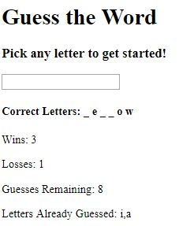

# Word Guess Game

## Summary
This is my word guess game created using javascript.

## Site Pictures


## Technologies Used 
- HTML - Used to create elements on the DOM
- JS - Used to manipulate content on HTML
- Git - version control system to track changes to source code
- Github - hosts repository that can be deployed to GitHub pages

## Code Snippet
The following code shows the onkeypress javascript function used to track the users key presses:
```js
document.onkeypress = function (guess) {
    
    var selectedLetter = guess.key;

}
```

The following code shows the result of the user guess the correct word:
```js
if (computerWord === correctLetters.join('')) {
    wins++;
    document.getElementById("wins").innerHTML = "Wins: " + wins;
    guessesRemaining = 10;
    document.getElementById("guessesRemaining").innerHTML = "Guesses Remaining: " + guessesRemaining;
    lettersGuessed = [];
    document.getElementById("lettersGuessed").innerHTML = "Letters Already Guessed: " + lettersGuessed;
    computerWord = wordList[Math.floor(Math.random() * wordList.length)];
    correctLetters = [];
    for (i = 0; i < computerWord.length; i++) {
        correctLetters[i]= "_";
        document.getElementById("correctLetters").innerHTML = correctLetters.join(' ');
    };
};
```

## Author Links
https://github.com/hagoodj